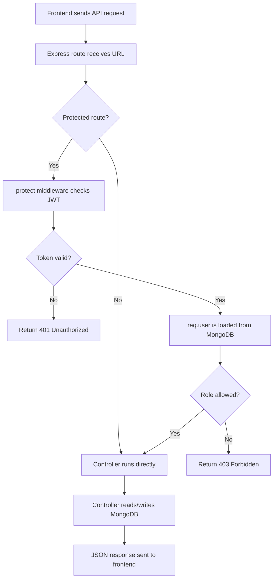
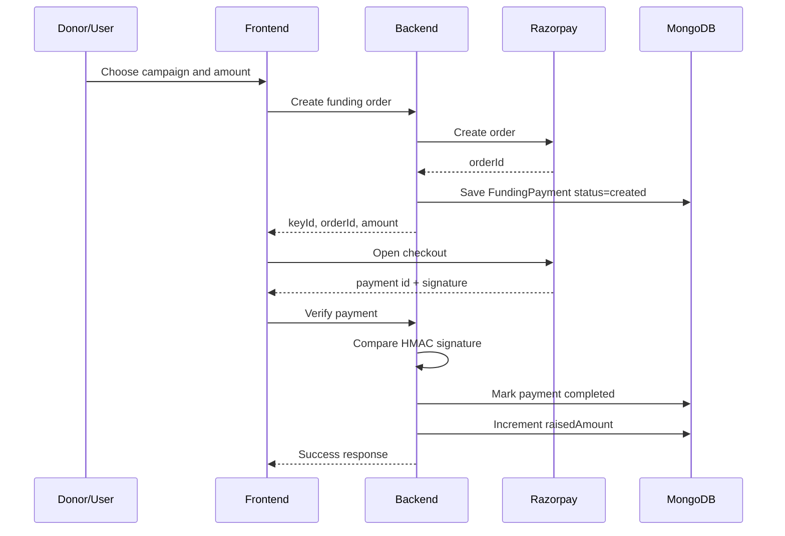
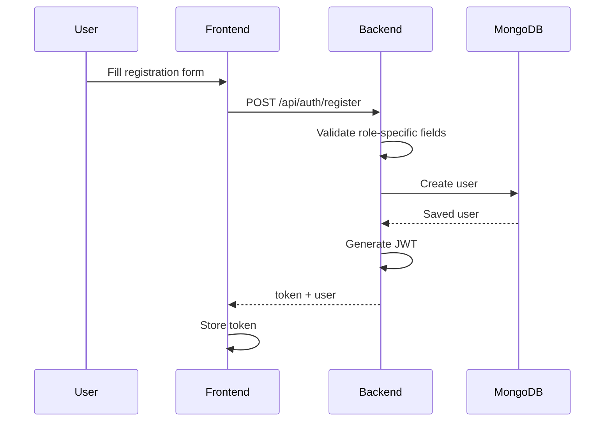
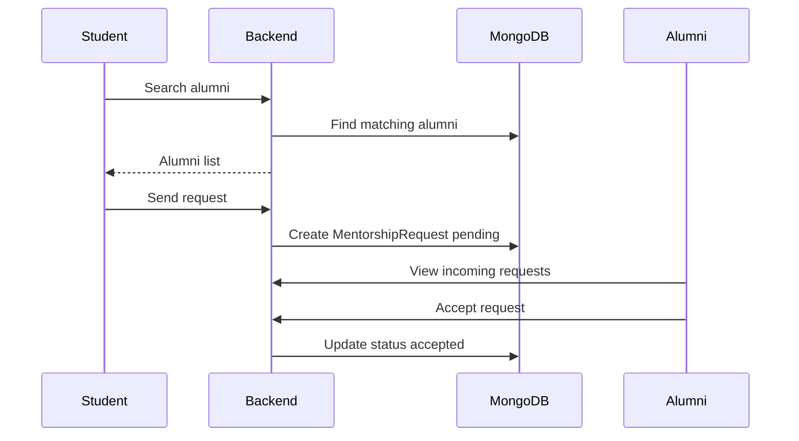
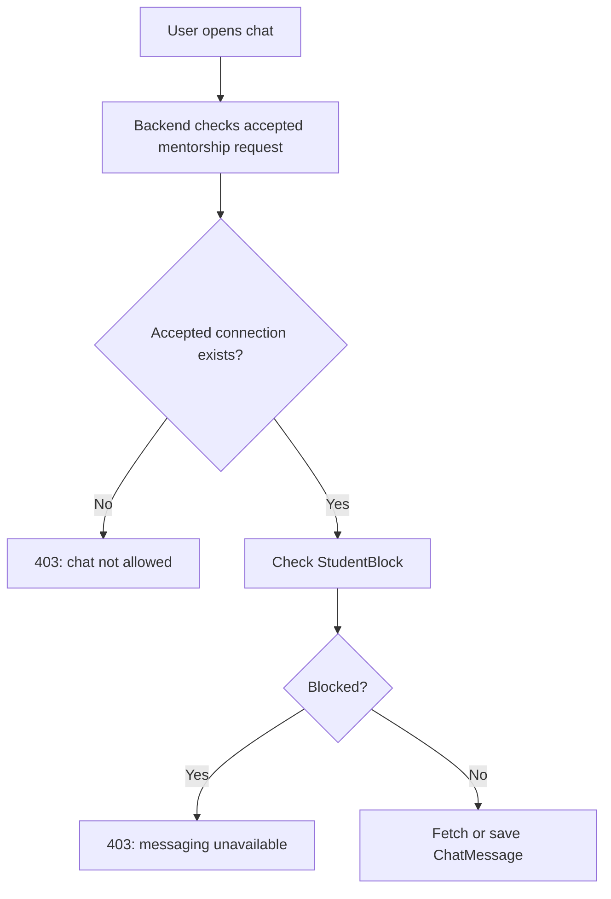
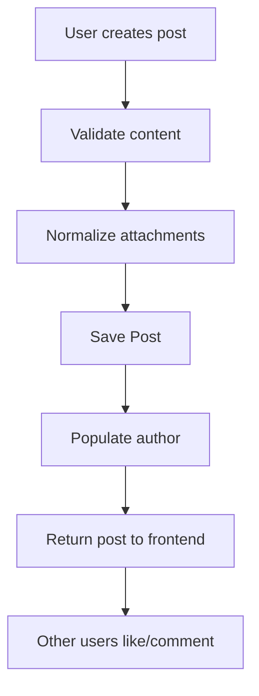
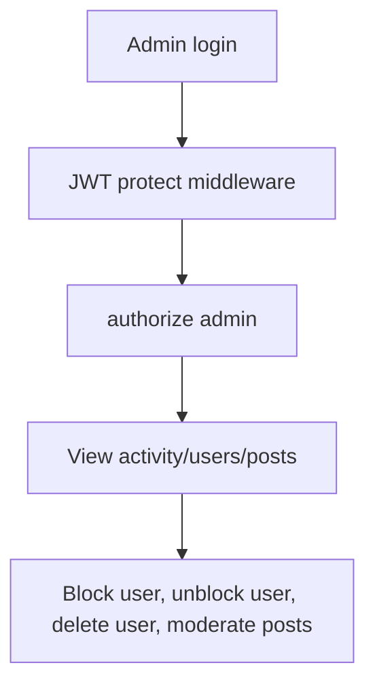

# ECE Alumni Platform

A web platform connecting ECE alumni with students for mentorship, networking, and career guidance.

## Tech Stack

- **Frontend:** React.js, Tailwind CSS
- **Backend:** Node.js, Express.js
- **Database:** MongoDB (Mongoose)
- **Real-time:** Socket.IO
- **Storage:** Cloudinary

## Features

- User registration & authentication (JWT)
- Alumni & student profiles
- Mentorship connections
- Real-time messaging
- Payment integration (Razorpay)

## Getting Started

### Prerequisites

- Node.js
- MongoDB

### Installation

1. Clone the repository

   ```bash
   git clone "url"
   cd "repo name"
   ```

2. Setup Backend

   ```bash
   cd backend
   cp .env.example .env   # Fill in your environment variables
   npm install
   npm run dev
   ```

3. Setup Frontend
   ```bash
   cd frontend
   cp .env.example .env
   npm install
   npm start
   ```

The app will run at `http://localhost:3000` (frontend) and `http://localhost:5000` (backend).

## Environment Variables

See `backend/.env.example` and `frontend/.env.example` for required variables.

---

## Team

- Jatin Gupta
- Nitish Bhagat
- Pranay Gupta

# ECE Alumni Platform Project Documentation

This document explains the uploaded `ECE_Alumni_platform-main` project in a chapter-by-chapter way. The extracted zip mainly contains the backend source code: MongoDB models, Express-style controllers, authentication middleware, Cloudinary configuration, database configuration, and a seeding guide.

Important note: the archive does not include some files normally required to run the backend, such as `package.json`, `server.js` or `app.js`, route files, utility files under `utils/`, frontend code, and the seed script referenced by `SEEDING_GUIDE.md`. Because of that, this documentation explains the available project code and also shows how those pieces would fit into a complete Express backend.

---

## Chapter 1: Project Purpose

The project is an ECE alumni platform. Its goal is to connect students, alumni, and admins in one system.

The main features visible in the backend are:

- User registration and login for students, alumni, and admins.
- JWT-based authentication.
- Role-based authorization.
- Student-to-alumni mentorship requests.
- Alumni/student chat after a mentorship request is accepted.
- Alumni search and network search.
- Community posts with likes, comments, attachments, and moderation.
- Referral-seeking posts where students ask alumni for help.
- Funding campaigns and Razorpay payment verification.
- Alumni events with Google Meet links.
- Landing page content management.
- Admin dashboard activity overview.
- Admin blocking, unblocking, and deleting users.
- Cloudinary media upload.

The platform is built around three user roles:

- `student`: searches alumni, sends mentorship requests, creates referral requests, chats after acceptance.
- `alumni`: receives mentorship requests, accepts/rejects students, chats with connected students, creates events/funding campaigns, blocks students.
- `admin`: manages users, landing content, posts, and platform activity.

---

## Chapter 2: Folder Structure

The extracted project structure is:

```text
ECE_Alumni_platform-main/
  .gitignore
  backend/
    .env
    .env.example
    SEEDING_GUIDE.md
    config/
      cloudinary.js
      db.js
    controllers/
      adminController.js
      authController.js
      chatController.js
      communityController.js
      postController.js
      referralController.js
      siteController.js
      uploadController.js
      userController.js
    middleware/
      auth.js
    models/
      AlumniEvent.js
      ChatMessage.js
      FundingCampaign.js
      FundingPayment.js
      MentorshipRequest.js
      PasswordResetOTP.js
      Post.js
      ReferralSeek.js
      SiteSettings.js
      StudentBlock.js
      User.js
    node_modules/
```

The important backend folders are:

- `config`: setup code for external services such as MongoDB and Cloudinary.
- `controllers`: request handler functions. These contain the main business logic.
- `middleware`: functions that run before controllers, mainly authentication and role checks.
- `models`: Mongoose schemas. These define MongoDB collections and document shapes.

In a full Express project, there would usually also be:

- `server.js` or `app.js`: starts Express and connects middleware/routes.
- `routes/`: maps URLs like `/api/auth/login` to controller functions.
- `utils/`: helper modules for email, Razorpay, cascade deletion, etc.
- `package.json`: defines dependencies and scripts like `npm run dev`.
- frontend folder: React/Vite/Next app or similar.

Those are referenced by the code and docs but are missing from this zip.

---

## Chapter 3: Technology Concepts

### Node.js

Node.js lets JavaScript run on the server. In this project, Node is used to build API logic: login, search, chat, posts, payments, uploads, and admin actions.

### Express-style Controllers

Even though route files are missing, the controllers are written for Express. A controller function usually receives:

```js
(req, res) => { ... }
```

- `req` means request. It contains body data, params, query strings, headers, and authenticated user info.
- `res` means response. It sends JSON back to the client.

Example pattern:

```js
res.status(200).json({
  success: true,
  data: result,
});
```

### MongoDB

MongoDB stores data as documents. A user, post, event, chat message, or funding campaign is saved as a document.

### Mongoose

Mongoose is an Object Data Modeling library for MongoDB. It lets the project define schemas such as `UserSchema`, then use methods like:

```js
User.find();
User.findById(id);
User.create(data);
User.countDocuments();
```

### JWT Authentication

JWT means JSON Web Token. After login/register, the server creates a token containing the user id. The frontend sends that token on protected requests:

```text
Authorization: Bearer <token>
```

The backend verifies the token and loads the logged-in user.

### Role-Based Authorization

The platform has different permissions for students, alumni, and admins. The `authorize()` middleware checks whether the logged-in user role is allowed.

### Cloudinary

Cloudinary is used to store uploaded images, videos, PDFs, and documents. The backend uploads file buffers to Cloudinary and returns public URLs.

### Razorpay

Razorpay is used for online funding campaign payments in INR. The backend creates payment orders and verifies signatures after payment.

---

## Chapter 4: Main Backend Workflow

A typical request flows like this:



This same pattern appears in almost every feature.

---

## Chapter 5: Configuration Files

### `config/db.js`

This file connects the backend to MongoDB:

- It imports `mongoose`.
- It reads `process.env.MONGO_URI`.
- It calls `mongoose.connect(...)`.
- It logs success or exits the process if the connection fails.
- It also calls `User.syncIndexes()` to make sure indexes match the current schema.

Important concept: environment variables keep secrets and deployment-specific settings outside the code.

Expected environment variable:

```text
MONGO_URI=<MongoDB connection string>
```

### `config/cloudinary.js`

This file configures Cloudinary using:

```text
CLOUDINARY_CLOUD_NAME
CLOUDINARY_API_KEY
CLOUDINARY_API_SECRET
```

Controllers can then upload files through the exported Cloudinary object.

---

## Chapter 6: Authentication Middleware

File: `middleware/auth.js`

This file exports two functions:

- `protect`
- `authorize`

### `protect`

`protect` checks whether a request has a valid JWT.

Workflow:

1. Read the `Authorization` header.
2. Check that it starts with `Bearer`.
3. Extract the token.
4. Verify the token using `JWT_SECRET`.
5. Find the user by id.
6. Reject inactive users.
7. Attach the user to `req.user`.
8. Continue to the next handler.

If anything fails, it returns `401` or `403`.

### `authorize(...roles)`

This checks whether the logged-in user has one of the allowed roles.

Example use in a route:

```js
router.get("/admin/users", protect, authorize("admin"), getAllUsers);
```

This means:

1. User must be logged in.
2. User must be admin.
3. Then `getAllUsers` can run.

---

## Chapter 7: User Model

File: `models/User.js`

The `User` model is the center of the system. Students, alumni, and admins are all stored in the same collection.

Main fields:

- `name`: required user name.
- `email`: required, unique, lowercase, validated.
- `password`: required, hidden by default with `select: false`.
- `role`: one of `student`, `alumni`, or `admin`.
- `interests`: array of interests.
- `skills`: array of skills.
- `bio`: profile biography.
- `profilePicture`: image URL.
- `coverImage`: profile banner URL.
- `headline`: short profile headline.
- `location`: user location.
- `company`: alumni company.
- `jobTitle`: alumni job title.
- `graduationYear`: alumni graduation year.
- `branch`: student branch.
- `year`: student year, from 1 to 4.
- `socialLinks`: optional list of profile links.
- `achievements`: optional list of achievements.
- `isActive`: used for blocking/deactivation.
- `blockedReason`: admin reason for blocking.
- `blockedAt`: when user was blocked.

### Password Hashing

Before saving a user, the schema runs:

```js
UserSchema.pre("save", async function (next) { ... });
```

If the password changed, it is hashed with bcrypt. This means plain passwords are not stored in MongoDB.

### Password Matching

The model defines:

```js
UserSchema.methods.matchPassword = async function (enteredPassword) { ... };
```

This compares a login password with the stored hash.

### Search Index

The schema creates a text index on:

- `name`
- `bio`
- `skills`
- `company`

That helps alumni search, although the current controller uses regex search instead of MongoDB text search.

---

## Chapter 8: Other Data Models

### `MentorshipRequest`

Represents a student's request to connect with an alumni mentor.

Key fields:

- `studentId`: reference to a student user.
- `alumniId`: reference to an alumni user.
- `status`: `pending`, `accepted`, `rejected`, or `cancelled`.
- `message`: student message.
- `respondedAt`: when alumni responded.
- `responseMessage`: response text/status message.

This model controls whether two users can chat.

### `ChatMessage`

Represents one message between users.

Key fields:

- `senderId`
- `receiverId`
- `message`
- `attachments`
- `linkUrl`
- `isRead`
- `readAt`

Messages are allowed only when there is an accepted mentorship connection.

### `Post`

Represents a community feed post.

Key fields:

- `author`
- `content`
- `thumbnailUrl`
- `attachments`
- `likes`
- `comments`
- `isPublished`
- `theme`

Comments are embedded inside the post document.

### `ReferralSeek`

Represents a student's referral/help request.

Key fields:

- `studentId`
- `title`
- `summary`
- `seekType`: `internship`, `full_time`, `research`, or `other`.
- `targetRoles`
- `targetCompanies`
- `skills`
- `linkUrl`
- `status`: `open`, `filled`, or `closed`.

Alumni can browse these requests.

### `StudentBlock`

Represents an alumni blocking a student.

Key fields:

- `alumniId`
- `studentId`
- `reason`

When a student is blocked, they cannot send mentorship requests or chat with that alumni.

### `FundingCampaign`

Represents a fundraising campaign.

Key fields:

- `title`
- `description`
- `goalAmount`
- `raisedAmount`
- `currency`
- `externalUrl`
- `acceptRazorpay`
- `imageUrl`
- `isActive`
- `createdBy`

### `FundingPayment`

Tracks Razorpay orders and payments.

Key fields:

- `campaign`
- `donor`
- `amountPaise`
- `orderId`
- `paymentId`
- `status`: `created`, `completed`, or `failed`.

### `AlumniEvent`

Represents alumni/community events.

Key fields:

- `title`
- `description`
- `googleMeetLink`
- `startsAt`
- `endsAt`
- `status`: `scheduled`, `cancelled`, or `completed`.
- `createdBy`

### `SiteSettings`

Stores editable landing page content.

It has a single key, usually `main`, and a nested `landing` object with:

- hero text
- success stories
- department content
- stats
- spotlights
- timeline
- gallery
- closing section

### `PasswordResetOTP`

Stores password reset OTP data.

Key fields:

- `email`
- `otpHash`
- `expiresAt`
- `attempts`
- `lastSentAt`

The OTP itself is not stored directly; only a bcrypt hash is stored.

---

## Chapter 9: Auth Controller

File: `controllers/authController.js`

This controller handles registration, login, profile, password reset, and self-deletion.

### `register`

Expected route:

```text
POST /api/auth/register
```

Workflow:

1. Read `name`, `email`, `password`, `role`, and role-specific fields.
2. Normalize email to lowercase.
3. Validate required fields.
4. Validate role.
5. If role is `admin`, check `ADMIN_REGISTER_SECRET`.
6. Check whether email already exists.
7. For alumni, require company.
8. For students, require branch and year.
9. Create the user.
10. Send welcome email if email service is configured.
11. Generate JWT.
12. Return token and public user data.

Concepts used:

- validation
- password hashing through model middleware
- duplicate email handling
- role-specific signup rules
- JWT generation
- safe public user response

### `login`

Expected route:

```text
POST /api/auth/login
```

Workflow:

1. Read email and password.
2. Normalize email.
3. Find user with password included using `.select("+password")`.
4. Reject inactive account.
5. Compare password with `user.matchPassword`.
6. Generate JWT.
7. Return token and user.

Why `.select("+password")` matters:

The password field is hidden by default in the schema, so login must explicitly request it.

### `getMe`

Expected route:

```text
GET /api/auth/me
```

Returns the current logged-in user. It depends on `protect` middleware setting `req.user`.

### `updateProfile`

Expected route:

```text
PUT /api/auth/profile
```

Allows the current user to update profile fields.

It sanitizes and limits data:

- name max 120 characters
- bio max 2000 characters
- profile/cover URLs max 2000 characters
- headline max 220 characters
- skills and interests limited in count and length
- alumni-only fields update only for alumni
- student-only fields update only for students

### `forgotPassword`

Expected route:

```text
POST /api/auth/forgot-password
```

Workflow:

1. Normalize email.
2. Return generic success for unknown/inactive users to avoid account enumeration.
3. Rate-limit OTP sending to once per minute.
4. Generate a six-digit OTP.
5. Hash OTP with bcrypt.
6. Store OTP hash and expiry.
7. Send email through the missing `utils/email` helper.

### `resetPassword`

Expected route:

```text
POST /api/auth/reset-password
```

Workflow:

1. Validate email, OTP, and new password.
2. Check OTP document exists and is not expired.
3. Block after too many attempts.
4. Compare OTP with stored hash.
5. Load user.
6. Set new password.
7. Save user, which hashes the password.
8. Delete OTP record.

### `deleteAccount`

Expected route:

```text
DELETE /api/auth/account
```

Deletes the current user's account and related data using the missing `utils/deleteUserCascade` helper.

For alumni, a deletion reason of at least 10 characters is required.

---

## Chapter 10: User and Mentorship Controller

File: `controllers/userController.js`

This controller handles user lists, alumni search, mentorship requests, and student blocking.

### Listing Users

Functions:

- `getAllStudents`
- `getAllAlumni`
- `getAllUsers`
- `getPlatformStats`

Students and alumni lists exclude inactive users. Admin list can return all users.

### Alumni Search

Function:

```js
searchAlumni;
```

Expected route:

```text
GET /api/users/search-alumni?q=react
```

The controller builds a case-insensitive regex and searches:

- name
- bio
- company
- skills
- jobTitle

If the viewer is a student, alumni who blocked that student are hidden.

### Network Search

Function:

```js
searchNetwork;
```

Expected route:

```text
GET /api/users/search-network?q=embedded
```

This is for alumni. It searches active students and alumni, excluding the current user. It also hides blocked students.

### Sending Mentorship Requests

Function:

```js
sendMentorshipRequest;
```

Expected route:

```text
POST /api/users/send-request
```

Workflow:

1. Student sends `alumniId` and optional message.
2. Backend checks alumni exists and is active.
3. Backend checks the student is not blocked by that alumni.
4. Backend checks no pending/accepted request already exists.
5. Create a `MentorshipRequest` with `pending` status.

### Responding to Requests

Function:

```js
respondToRequest;
```

Expected route:

```text
PUT /api/users/respond-request/:id
```

Only the alumni who owns the request can accept or reject it.

Once accepted, the student and alumni become eligible to chat.

### Blocking Students

Functions:

- `blockStudent`
- `unblockStudent`
- `listBlockedStudents`

When alumni blocks a student:

1. A `StudentBlock` record is created.
2. Pending mentorship requests from that student are rejected.
3. Search and chat features respect the block record.

---

## Chapter 11: Chat Controller

File: `controllers/chatController.js`

This controller stores and retrieves messages.

### Core Rule

Users can only chat if:

1. They have an accepted mentorship request.
2. There is no `StudentBlock` record between them.

### `getMessages`

Expected route:

```text
GET /api/chat/messages/:otherUserId
```

Returns all messages between the logged-in user and another user, sorted oldest first.

### `saveMessage`

Expected route:

```text
POST /api/chat/messages
```

Saves a message after validating:

- receiver exists in the request body.
- message has text, attachment, or link.
- users are connected.
- users are not blocked.

It supports:

- text message
- file/image attachments
- link URL

### `getConversations`

Expected route:

```text
GET /api/chat/conversations
```

Gets all accepted mentorship connections and builds conversation previews:

- other user
- last message preview
- last message time
- unread count

### `markMessagesAsRead`

Expected route:

```text
PUT /api/chat/messages/mark-read/:otherUserId
```

Marks unread messages from the other user as read.

### `getUnreadCount`

Expected route:

```text
GET /api/chat/unread-count
```

Returns total unread messages for the logged-in user.

---

## Chapter 12: Post Controller

File: `controllers/postController.js`

This controller powers a community feed.

### `getPosts`

Expected route:

```text
GET /api/posts
```

Returns published posts, newest first, with author and comment user details populated.

### `createPost`

Expected route:

```text
POST /api/posts
```

Creates a post with:

- author from `req.user.id`
- content
- thumbnail URL
- attachments

Content is required.

### `toggleLikePost`

Expected route:

```text
PUT /api/posts/:id/like
```

If the current user has liked the post, it removes the like. Otherwise, it adds the like.

### `addCommentToPost`

Expected route:

```text
POST /api/posts/:id/comments
```

Adds a comment by the current user.

### `updatePost`

Expected route:

```text
PUT /api/posts/:id
```

Only the post owner or admin can update.

### `deletePost`

Expected route:

```text
DELETE /api/posts/:id
```

Only the post owner or admin can delete.

### `deleteComment`

Expected route:

```text
DELETE /api/posts/:id/comments/:commentId
```

Only the comment owner or admin can delete a comment.

---

## Chapter 13: Referral Controller

File: `controllers/referralController.js`

This feature lets students create referral/help requests and lets alumni browse them.

### `createReferralSeek`

Expected route:

```text
POST /api/referrals
```

Only active students can create referral posts.

Required fields:

- `title`
- `summary`

Optional fields:

- `seekType`
- `targetRoles`
- `targetCompanies`
- `skills`
- `linkUrl`

### `listReferralSeeksForAlumni`

Expected route:

```text
GET /api/referrals
```

Alumni can filter by:

- query text `q`
- branch
- seek type
- status

### `getMyReferralSeeks`

Expected route:

```text
GET /api/referrals/my
```

Returns referral requests created by the logged-in student.

### `updateReferralSeek`

Only the student who created the referral request can update it.

### `deleteReferralSeek`

Only the owner can delete the referral request.

---

## Chapter 14: Community Controller

File: `controllers/communityController.js`

This controller has two major feature groups:

- funding campaigns
- alumni events

### Funding Campaigns

Functions:

- `listFunding`
- `createFunding`
- `updateFunding`
- `deleteFunding`

Campaign visibility depends on role:

- admin sees all campaigns.
- alumni sees active campaigns and campaigns they created.
- students see active campaigns.

Only admin or campaign creator can update/delete a campaign.

### Razorpay Payment Flow

Functions:

- `getRazorpayMeta`
- `createFundingOrder`
- `verifyFundingPayment`

Workflow:



Important payment concept:

The backend does not blindly trust the frontend after payment. It recomputes the Razorpay signature using `RAZORPAY_KEY_SECRET`.

### Alumni Events

Functions:

- `listEvents`
- `createEvent`
- `updateEvent`
- `deleteEvent`

Events require a valid Google Meet link. Event visibility depends on role:

- admin sees all events.
- alumni sees public scheduled/completed events and their own events.
- students see scheduled/completed events.

---

## Chapter 15: Site Controller

File: `controllers/siteController.js`

This controls the landing page content.

### `getLanding`

Expected route:

```text
GET /api/site/landing
```

Public endpoint. It returns landing page data. If no document exists, it creates one using default content.

### `updateLanding`

Expected route:

```text
PUT /api/site/landing
```

Admin endpoint. It updates landing page sections:

- hero title/subtitle/badge
- media URLs
- success stories
- department description
- stats
- alumni spotlights
- timeline
- gallery
- closing title/subtitle

It sanitizes URLs and limits array sizes to keep content controlled.

---

## Chapter 16: Admin Controller

File: `controllers/adminController.js`

This controller contains admin-only operations.

### `getActivityOverview`

Expected route:

```text
GET /api/admin/activity
```

Returns:

- total users
- student count
- alumni count
- admin count
- active/inactive users
- published/all posts
- chat message count
- pending/accepted mentorship count
- open referral count
- signups in last 7 and 30 days
- recent users

It uses `Promise.all` to run many counts in parallel.

### `blockUser`

Expected route:

```text
PUT /api/admin/users/:userId/block
```

Admin can deactivate a user, except:

- admin cannot block self.
- admin cannot block another admin from this endpoint.

### `unblockUser`

Expected route:

```text
PUT /api/admin/users/:userId/unblock
```

Reactivates a blocked user.

### `deleteUserAccount`

Expected route:

```text
DELETE /api/admin/users/:userId
```

Permanently deletes a user and related data through the missing `deleteUserCascade` utility.

### `listPostsForModeration`

Expected route:

```text
GET /api/admin/posts
```

Lets admin search posts by:

- post content
- author name/email
- limit

It returns published and unpublished posts for moderation.

---

## Chapter 17: Upload Controller

File: `controllers/uploadController.js`

This controller uploads files to Cloudinary.

Expected route:

```text
POST /api/uploads/post-media
```

It expects `req.files`, so a route would normally use Multer memory storage before this controller.

Allowed files:

- images: JPG, PNG, GIF, WebP
- videos: MP4, WebM, MOV
- documents: PDF, DOC, DOCX, TXT

Workflow:

1. Check Cloudinary environment variables.
2. Check files were uploaded.
3. Validate MIME type.
4. Determine Cloudinary resource type: `image`, `video`, or `raw`.
5. Upload file buffer.
6. Return uploaded file URLs and metadata.

---

## Chapter 18: Complete Feature Workflows

### Registration and Login



### Mentorship Request



### Chat



### Community Post



### Admin Moderation



---

## Chapter 19: Expected API Map

The route files are missing, but based on controller comments and function names, routes would likely look like this.

### Auth

```text
POST   /api/auth/register
POST   /api/auth/login
GET    /api/auth/me
PUT    /api/auth/profile
POST   /api/auth/forgot-password
POST   /api/auth/reset-password
DELETE /api/auth/account
```

### Users and Mentorship

```text
GET    /api/users/students
GET    /api/users/alumni
GET    /api/users/all
GET    /api/users/stats
GET    /api/users/search-alumni?q=value
GET    /api/users/search-network?q=value
POST   /api/users/send-request
GET    /api/users/:id
GET    /api/users/my-requests
GET    /api/users/incoming-requests
PUT    /api/users/respond-request/:id
POST   /api/users/block-student
DELETE /api/users/block-student/:studentId
GET    /api/users/blocked-students
```

### Chat

```text
GET  /api/chat/messages/:otherUserId
POST /api/chat/messages
GET  /api/chat/conversations
PUT  /api/chat/messages/mark-read/:otherUserId
GET  /api/chat/unread-count
```

### Posts

```text
GET    /api/posts
POST   /api/posts
PUT    /api/posts/:id/like
POST   /api/posts/:id/comments
PUT    /api/posts/:id
DELETE /api/posts/:id
DELETE /api/posts/:id/comments/:commentId
```

### Referrals

```text
POST   /api/referrals
GET    /api/referrals
GET    /api/referrals/my
PUT    /api/referrals/:id
DELETE /api/referrals/:id
```

### Funding and Events

```text
GET    /api/community/funding
POST   /api/community/funding
PUT    /api/community/funding/:id
DELETE /api/community/funding/:id
GET    /api/community/razorpay/meta
POST   /api/community/funding/:id/order
POST   /api/community/funding/:id/verify
GET    /api/community/events
POST   /api/community/events
PUT    /api/community/events/:id
DELETE /api/community/events/:id
```

### Site

```text
GET /api/site/landing
PUT /api/site/landing
```

### Admin

```text
GET    /api/admin/activity
PUT    /api/admin/users/:userId/block
PUT    /api/admin/users/:userId/unblock
DELETE /api/admin/users/:userId
GET    /api/admin/posts
```

### Upload

```text
POST /api/uploads/post-media
```

---

## Chapter 20: Missing Pieces in the Zip

The current archive is not a complete runnable app. The code references files/folders that are not present.

Missing but referenced:

- `utils/deleteUserCascade`
- `utils/email`
- `utils/razorpayClient`
- `scripts/seedDatabase.js`
- `package.json`
- `server.js` or `app.js`
- route files
- frontend app

Why this matters:

- `authController.js` will fail to load without `utils/email` and `utils/deleteUserCascade`.
- `adminController.js` will fail without `utils/deleteUserCascade`.
- `communityController.js` will fail without `utils/razorpayClient`.
- `npm run seed` cannot work without `package.json` and `scripts/seedDatabase.js`.
- No backend server can start without an app entry file.
- No API URL mapping exists without route files.

The code is still useful because the main domain logic is present, but it needs the missing pieces restored before running.

---

## Chapter 21: How a Complete Express App Would Connect These Files

A typical missing `server.js` would do something like this:

```js
const express = require("express");
const cors = require("cors");
const dotenv = require("dotenv");
const connectDB = require("./config/db");

dotenv.config();
connectDB();

const app = express();
app.use(cors());
app.use(express.json());

app.use("/api/auth", require("./routes/authRoutes"));
app.use("/api/users", require("./routes/userRoutes"));
app.use("/api/chat", require("./routes/chatRoutes"));
app.use("/api/posts", require("./routes/postRoutes"));
app.use("/api/referrals", require("./routes/referralRoutes"));
app.use("/api/community", require("./routes/communityRoutes"));
app.use("/api/site", require("./routes/siteRoutes"));
app.use("/api/admin", require("./routes/adminRoutes"));
app.use("/api/uploads", require("./routes/uploadRoutes"));

const PORT = process.env.PORT || 5000;
app.listen(PORT, () => console.log(`Server running on ${PORT}`));
```

Routes would import middleware and controllers. For example:

```js
const express = require("express");
const { register, login, getMe } = require("../controllers/authController");
const { protect } = require("../middleware/auth");

const router = express.Router();

router.post("/register", register);
router.post("/login", login);
router.get("/me", protect, getMe);

module.exports = router;
```

That is the bridge between URL paths and controller functions.

---

## Chapter 22: Environment Variables

Based on the code, the backend expects variables such as:

```text
MONGO_URI=
JWT_SECRET=
JWT_EXPIRE=
ADMIN_REGISTER_SECRET=

CLOUDINARY_CLOUD_NAME=
CLOUDINARY_API_KEY=
CLOUDINARY_API_SECRET=
CLOUDINARY_FOLDER=

RAZORPAY_KEY_ID=
RAZORPAY_KEY_SECRET=

RESEND_API_KEY=
RESEND_FROM=
SMTP_USER=
SMTP_PASS=
NODE_ENV=
PORT=
```

Not all are mandatory for every feature. For example:

- Login/register needs MongoDB and JWT variables.
- Uploads need Cloudinary variables.
- Razorpay payments need Razorpay variables.
- Email password reset needs Resend or SMTP variables.
- Admin registration needs `ADMIN_REGISTER_SECRET`.

---

## Chapter 23: Learning Path

To learn the project properly, study it in this order:

1. Start with `models/User.js`.
   Understand roles, password hashing, and profile fields.

2. Read `middleware/auth.js`.
   Learn how JWT turns a token into `req.user`.

3. Read `controllers/authController.js`.
   This teaches register, login, profile update, OTP, and account deletion.

4. Read `models/MentorshipRequest.js`, then `controllers/userController.js`.
   This explains the core student-alumni connection feature.

5. Read `models/ChatMessage.js`, then `controllers/chatController.js`.
   This explains why accepted mentorship is required before messaging.

6. Read `models/Post.js`, then `controllers/postController.js`.
   This explains feed behavior, likes, comments, and ownership checks.

7. Read `models/ReferralSeek.js`, then `controllers/referralController.js`.
   This explains student referral requests and alumni filtering.

8. Read funding/event models, then `controllers/communityController.js`.
   This is more advanced because it includes payments and external APIs.

9. Read `controllers/adminController.js`.
   This explains platform-level moderation and analytics.

10. Read `controllers/siteController.js`.
    This explains editable landing page content.

11. Read `controllers/uploadController.js`.
    This explains file validation and Cloudinary upload.

---

## Chapter 24: Key Concepts to Master

### Request Body vs Query vs Params

Examples:

```text
req.body.email
req.query.q
req.params.id
```

- `body` is data sent in POST/PUT requests.
- `query` is data after `?` in a URL.
- `params` is data inside the route path.

### HTTP Status Codes

Common status codes in this project:

- `200`: success
- `201`: created
- `400`: bad input
- `401`: not logged in or invalid token
- `403`: logged in but not allowed
- `404`: not found
- `500`: server error
- `503`: service not configured/unavailable

### Populate

Mongoose `populate()` replaces an ObjectId with selected fields from another collection.

Example:

```js
.populate("alumniId", "name email company jobTitle")
```

Instead of only returning an alumni id, it returns useful alumni profile fields.

### Ownership Checks

Many controllers check ownership before editing/deleting:

```js
const isOwner = post.author.toString() === req.user.id;
const isAdmin = req.user.role === "admin";
```

This prevents users from modifying other users' content.

### Sanitization

The project trims strings, limits lengths, validates URLs, and restricts arrays.

This protects against:

- huge payloads
- bad URLs
- invalid data
- accidental database clutter

### Soft Block vs Delete

Blocking a user usually sets:

```js
isActive: false;
```

Deleting removes records permanently and should cascade related data.

---

## Chapter 25: Suggested Improvements

These are improvements you could make after restoring the missing files:

- Add complete route files.
- Restore/create `server.js`.
- Restore/create `package.json`.
- Add missing `utils` files.
- Add validation middleware with a library like Joi or Zod.
- Add rate limiting for login and OTP endpoints.
- Escape regex in `searchAlumni`; `searchNetwork` already does this.
- Add automated tests for auth, mentorship, chat, and payments.
- Add API documentation with Swagger/OpenAPI.
- Avoid committing `.env` and `node_modules` to git.
- Add centralized error handling middleware.
- Add pagination to posts, users, referrals, messages, and admin lists.
- Add Socket.IO server logic if real-time chat is intended.

---

## Chapter 26: Final Mental Model

Think of the project in layers:

```text
Frontend
  sends HTTP requests with token

Routes
  connect URLs to middleware/controllers

Middleware
  checks login and role

Controllers
  contain business logic

Models
  define MongoDB data shape

External Services
  MongoDB, Cloudinary, Razorpay, email provider
```

The most important relationship is:

```text
Student -> MentorshipRequest -> Alumni
```

Once that request becomes `accepted`, chat becomes possible:

```text
Accepted MentorshipRequest -> ChatMessage allowed
```

Admin sits above the system:

```text
Admin -> users, posts, activity, landing page
```

Community features extend the platform:

```text
Posts + Referrals + Funding + Events
```

That is the full conceptual map of the project present in the uploaded zip.

                                                    Thank You!
